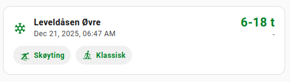
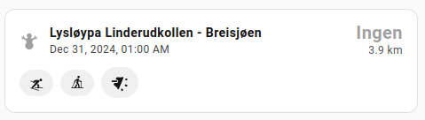

[](https://github.com/toringer/home-assistant-sporet)
[](https://github.com/toringer/home-assistant-sporet/actions/workflows/hassfest.yaml)
[](https://github.com/toringer/home-assistant-sporet/actions/workflows/validate_hacs.yaml)
[](https://github.com/toringer/home-assistant-sporet)
[](https://github.com/toringer/home-assistant-sporet)
[](https://github.com/toringer/home-assistant-sporet)


# Sporet.no - Home Assistant Integration

<div align="center">
  
</div>

A Home Assistant custom component for monitoring cross-country ski trail conditions from [Sporet.no](https://sporet.no/).

## Features

- Monitor ski trail slope status
- Track trail preparation time
- View preparation quality across slope segments
- Automatic updates every 15 minutes


## Installation

### HACS (Recommended)

1. Open HACS in your Home Assistant instance
2. Click on "Integrations"
3. Click the three dots in the top right corner
4. Select "Custom repositories"
5. Add this repository URL: `https://github.com/yourusername/home-assistant-sporet`
6. Select "Integration" as the category
7. Click "Add"
8. Find "Sporet" in the HACS integration list and click "Download"
9. Restart Home Assistant

### Manual Installation

1. Download the `custom_components/sporet` folder from this repository
2. Copy the entire `sporet` folder to your Home Assistant `custom_components` directory:
   - Path: `<config_dir>/custom_components/sporet/`
3. Restart Home Assistant

## Configuration

### Prerequisites

Before setting up the integration, you need:

1. **Ski Trail Slope ID**: Find this at [sporet.no](https://sporet.no/)
   - Navigate to your desired ski trail
   - Select a slope in the map
   - Click the `Share` button
   - Extract the slope id from the copied URL


2. **Bearer Token**:
   - Log in to sporet.no
   - Open the network anaylser in the developer tools of the browser
   - Find the `details` traffic, find the `authorization` attribute in the header section
   - Copy the token (remove the `Bearer` text)


### Setup Steps

1. In Home Assistant, go to **Settings** → **Devices & Services**
2. Click **+ Add Integration**
3. Search for "Sporet"
4. Enter your configuration:
   - **Ski Trail Slope ID**: The specific slope you want to monitor
   - **Bearer Token**: Your API authentication token
5. Click **Submit**

The integration will validate your credentials and create sensors for the specified slope.

## Sensors

The integration creates three sensors for each configured slope:

### 1. Prepped Time
- **Entity ID**: `sensor.<slope_name>_prepped_time`
- **Description**: Timestamp of when the trail was last prepared
- **Device Class**: Timestamp
- **Example**: `2025-12-01T09:06:12Z`

### 2. Prep Symbol
- **Entity ID**: `sensor.<slope_name>_prep_symbol`
- **Description**: Numeric code indicating overall trail condition
- **Values**:
  - `30`: Good condition
  - `50`: Fair condition
  - `70`: Poor condition or not groomed
  - Other values as defined by Sporet
- **Example**: `30`

### 3. Prep Symbol Parts
- **Entity ID**: `sensor.<slope_name>_prep_symbol_parts`
- **Description**: Shows the lowest prep symbol value across all route segments
- **Attributes**: Contains `parts` array with detailed breakdown by segment
- **Example**: `30` (lowest value from all segments)

### Additional Attributes

Each sensor includes additional attributes with detailed route information:

- `slope_id`: The route identifier
- `slope_name`: Name of the ski trail route
- `destination_name`: Name of the destination area
- `county`: County name
- `municipal`: Municipality name
- `country`: Country
- `prepped_by`: Organization responsible for grooming
- `hasClassic`: Boolean - Classic skiing available
- `hasSkating`: Boolean - Skating skiing available
- `hasFloodlight`: Boolean - Floodlight available
- `isScooterTrail`: Boolean - Scooter trail
- `routelength`: Total length of the route in meters
- `totalElevationGain`: Total elevation gain in meters
- `totalElevationLoss`: Total elevation loss in meters
- `parts`: (prep_symbol_parts sensor only) Array of segment-level prep symbols with percentages

## Sporet Card

A spimple card for Lovelace is included in sporet-card.js





The card can be configured from the GUI.

To add the card manually, need to manually find the Device ID of a Slope.  
The device ID can be found in the URL when you go into configuration of the Device:

`https://your.ha.url/config/devices/device/0db129eb80c612a5bff671925fad7735` -
here `0db129eb80c612a5bff671925fad7735` is the device id.

```yaml
type: custom:sporet.no-card
device_id: 0db129eb80c612a5bff671925fad7735
```

Optionally control some features of the card
```yaml
tint_badges_with_primary_color: true
show_badge_text: true
floodlight_icon: mdi:light-flood-down

```


## Updating Bearer Token

If your bearer token expires or needs to be updated:

1. Go to **Settings** → **Devices & Services**
2. Find the "Sporet" integration
3. Click **Configure**
4. Enter your new bearer token
5. Click **Submit**

The integration will reload with the new token without losing your configuration.

## Example Automation

### Notify when trail is freshly groomed

```yaml
automation:
  - alias: "Notify when trail is groomed"
    trigger:
      - platform: state
        entity_id: sensor.sjusjoen_ljosheim_kort_prepped_time
    condition:
      - condition: template
        value_template: >
          {{ (now() - states.sensor.sjusjoen_ljosheim_kort_prepped_time.state | as_datetime).total_seconds() < 3600 }}
    action:
      - service: notify.mobile_app
        data:
          title: "Trail Groomed!"
          message: "Ljøsheim trail segment was just groomed."
```

### Display trail condition in Lovelace

```yaml
type: entities
title: Ski Trail Status
entities:
  - entity: sensor.heistadmoen_10_km_prepped_time
    name: Last Groomed
  - entity: sensor.heistadmoen_10_km_prep_symbol
    name: Overall Condition
  - entity: sensor.heistadmoen_10_km_prep_symbol_parts
    name: Worst Segment Condition
```

## API Details

The integration uses the Sporet public API:

- **Endpoint**: `https://api.sporet.no/loypeapi/public/skiroutes/{slope_id}/details`
- **Authentication**: Bearer token in Authorization header
- **Update Interval**: 900 seconds (15 minutes)
- **Method**: GET


## Troubleshooting

### Cannot Connect Error

- Verify your internet connection
- Check if sporet.no is accessible
- Ensure the API endpoint is not blocked by your firewall

### Invalid Auth Error

- Verify your bearer token is correct
- Check if the token has expired
- Regenerate a new token from sporet.no

### Route Not Found Error

- Verify the slope ID exists on sporet.no
- Check the slope ID is correct
- Make a manual API call to verify the route exists

### Enable Debug Logging

Add to your `configuration.yaml`:

```yaml
logger:
  default: info
  logs:
    custom_components.sporet: debug
```

## Development

This integration includes a development container for easy testing:

1. Open the project in VS Code
2. Install the "Remote - Containers" extension
3. Click "Reopen in Container" when prompted
4. The development Home Assistant instance will start automatically
5. Access at `http://localhost:8123`

## Support

For issues, feature requests, or contributions:
- GitHub Issues: [Create an issue](https://github.com/yourusername/home-assistant-sporet/issues)
- Discussions: [Join the discussion](https://github.com/yourusername/home-assistant-sporet/discussions)

## License

This project is licensed under the MIT License - see the LICENSE file for details.

## Credits

- Data provided by [Sporet.no](https://sporet.no/)
- Integration developed for Home Assistant


